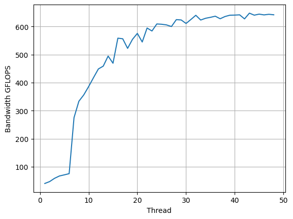
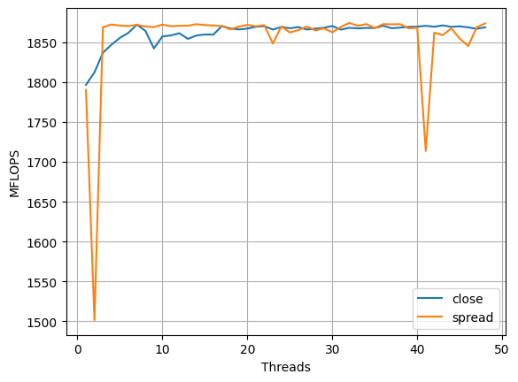

# Assignment 1 Report
Group: 103 - Fujitsu A64FX

Part 1. General Questions : Group 103 - Fujitsu A64FX

    a) Explain the logic of the loop in line 116 and elaborate on how the size of the vector and the iterations are changed in the provided code. Furthermore, explain the flop calculation login (line 121).
    Ans: The loop (line 116) help us to get an overview of MFLOPS of different datasetsize (32 <= datasetsize <= N, whereas N is the input) and each datasetsize has its own number of cycles (cycles are calculated using the REP and datasetsize).
    With the increase of the size of vectors, the number of iterations (Cycle) will get reduced by the factor 1/2
    Generally, MFLOPS (million floating-point operations per second) is calculated as:
    Number of floating-point operations / (Exceution time * 10^6) (1)
    As from the given hint excluding load and store, from line 57 to line 61 and from line 67 to 71, we have for loop calculating the result and we have 2 operations. Both for loops are iterating until the cycles and the datasetsize, that is why we are multiplying the (double) datasetsize * (double) cycles and because we have two operations we are multiplying with 2.0. The Term 1.e-6 is from the formula (1).
    
    b) The microbenchmark is implemented using function triad in line 28. Try to explain the parameters and returning value of this function. Specifically, what is the purpose of parameter REP?
    Ans: In line 28, the amount of time spent has been compute using two parameters begin and end. The value of begin assigned by the method get_curr_time()
    and the parameter is placed before the starting of the second for loop. Same as the begin, end parameter get calculated.
    The parameter REP gives us the number of time we have to iterate for the specific datasetsize.
  
    c) Since in the provided code the function triad takes care of all the microbenchmark code including threading, we are querying the number of threads in line 36 using omp_get_num_threads(). EXplain what the reason for creating a parallel region in line 34 is.
    Ans: In order to paralleized the code block and to produce the number of threads more than 1, the region has been parallalized.
   
    d) aligned_alloc assigned memory block based upon the alignment of first arugment(which is ALIGNMENT in this case). The cache which are used for handling the memory are known as cache line. Maninly the cache line are 32, 64 and 128 bytes. Alignment also helps to increase the performance.
    
    e) In order to work efficiently with the threads, we have parallezied the loop and because the for loop is dependent upon the input given by the user, we have chosen static so that the threads are equally distributed among the iteration.
    
    f) With the help of first Loop (from line 58 to 62), the second for loop (from line 67 to 73) can fetch the store and load the data from the cache and it will also helps to improves the performance and gives us faster memory access. 

    g) 
	i) We are creating the parallel region on 65 so that omp_get_num_threads(); returns the correct number of running threads. 
	ii) The policy schedule(static) mapes the work in a round-robin fashion to the threads. Because we also use this policy during initialization. It is guaranteed that a thread allocates the memory he is going to use in his NUMA domain. 
	iii) Nowait makes that the threads don't have to wait for the other threads to finish to start the next iteration. 

    h) Apart from verifying the results, is there any other reason for using this checksum function?
    Without the checksum there might be a chance the compiler optimizes the whole computation. Because the variable are not used. 

Part 2. Experiments and Measurements: Group 103 - Fujitsu A64FX 

    In the following subtasks the icc compiler was used unless stated otherwise.

    a) The plot for MFLOPS in regard to the data size. We can clearly see the different memory hierachies in the plot. 

    b) Explain why we can convert GFLOPS to memory bandwidth utilization by simply scaling the GFLOPS values with a factor of 16. 
    Ans: For every element-wise addition and multiplication we load 3 doubles with each 8 Bytes and write to one double with 8 Bytes. The memory utilization is therefore: 
     ( 3 * 8 + 8  ) / 2 = 16 

    c) Compute the maximum theortical memory bandwidth of the BEAST system assigned to your group and compare the results of ypur bandwidth measurements in 2.b to the maximum theortical memory bandwidth.
    Ans: Maximum theortical bandwidth = (number of memory channels)(transfer width)(data rate)
    The maximum theoretical memory bandwidth is 4*256 GB/s (HBM2) = 1024 GB/s in our experiment we just able to utilize the memory bandwidth up to 110 GB/s 

    d) Repeat the experiment in part 2.a with different thread numbers:

    e) As from both of Graphs, a higher number of threads lead to improvement of the performance.

       

    f) With the removal of parallelization, performance will get slowered because of the NUMA affect. The memory will get allocated to the thread which is currently running, which means rest of the threads have to access the one memory domain through bus. After removing the parallelization before the initailization, there will be one NUMA domain. 

    
    g) The following graphs show the MFLOP/s and Bandwidth utilization for the (static,1) policy. We can observe that the (static,1) performance worse than the static policy. This is because (static,1) divides the tasks sequentielly. Therefore each thread takes one iteration, but because the one double - 8 Bytes is smaller than the allocated aligned Level 1 cache line size. The following Threads also allocates their memory in the NUMA domain of the previous thread. Memory access across the BUS significantly decreases the performance.

    The dynamic scheduler performs better than the static one. As it balances out performance differences. But it also suffers from the missing memory locality due to the disjointed allocation of memory and tasks.

    h) With the removal nowait, we can betterment in the performance, because in the nowait after finishing the respective threads will leave but if if we enable the nowait then all the threads have to wait until all the threads are finished with their respective tasks.

    i) In case of small dataset size for example in case 2^17 we are not able to see a huge difference in the performance because memory did not get spread. But with the increase in the datasetsize we can see huge difference in MFLOPS 
    because with spread memory is distributed among cores and its benefical to spread thread in the same as memory. 

    j)

