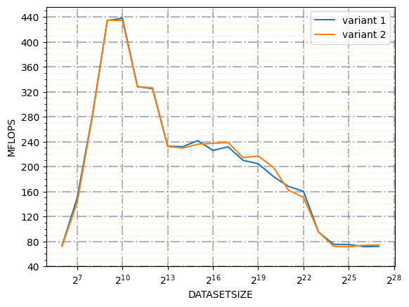

# Assignment 2 Report
Group: 103

    3,4) Armanpreet Ghotra

    3) On the Machine thx2, from the graph we can clearly see that the variant 2 is better as comapa>
    we added clauses:
    1) #pragma omp target enter data map(alloc: a[0:datasetsize], b[0:datasetsize], c[0:datasetsize],
    d[0:datasetsize]) : 
    First of all, we have allocated the memory on the target device (GPU).
    2) #pragma omp target exit data map(from: a[0:datasetsize]) map(release:b[0:datasetsize], c[0:datasetsize],d[0:datasetsize]) : 
    Now we use from clause with variable a and used release clause with variable b,c and d. We only copy back the value of variable a to the CPU and do not need to copy any other variable.Performance is better because this copy back happens only at the end of the computation and not after every iteration.
    
    On the maschine ROME1, variant 2 is slightly better than variant 1 not as better in maschine thx2. It could be depend on maschine. 

maschine thx2

maschine rome1

4) In this we have chosen schedule(static,1) and schedule(Dynamic).Distribute clause without any additional scheduling clause is better among others. This could be due to no additional overhead due to scheduling. Distribute also do a kind of scheduling for teams. One or more loops will get exceuted teams of thread. Distribute + schedule (static,1) has the second best performance among other. schedule(dynamic) gives us sometimes overhead due to the irregular distribution of workload and distribution of workloads among threads during run time, whereas schedule(static,1) shared equal workload and the threads kind of have of information in which chunk size, will be loop/iterations get divided. We can clearly see the difference in Graph of maschine thx2, whereas on the other hand graph of rome1, distribute + dynamic is slightly better than static,1. It maybe, because of lower overhead depending upon the maschine.

Maschine thx2

Maschine Rome1

## Exercise 5 - Oliver Yat-Sing Fung

For the following tests I used the thunderx2 and rome1 node using the results from the previous tasks I did not specify any scheduling and initialized the data on the GPU beforehand. 

### B: Team size optimum  

As we can observer from the data the optimum number for the team size is around 1024 on the NVIDIA V100 GPU. After this point you can not observe an increase in performance. The V100 card has 2560 double precision CUDA cores (source: https://cvw.cac.cornell.edu/gpuarch/tesla), due to memory contention 1024 might be the optimum number of teams. 

_thunderx2_

For the AMD MI100 GPU we can observe that the optimum number of teams is 4096. The AMD MI100 GPU has 3840 double precision cores  (source: https://www.heise.de/news/Server-Beschleuniger-AMD-Instinct-MI100-Ohne-Radeon-aber-mit-11-5-FP64-TFlops-4960973.html). That's why we can observe here the higher optimum regarding the number of teams. Interestingly the optimum 4096 is here higher than the number of cores 3840.  

_rome1_

In this experiment the NVIDIA GPU performs better than AMD GPU, when scaling the number of teams and just using one thread per team. 

### C: Thread optimum 

On the NVIDIA V100 the optimum number of threads per team is between 40 and 60 threads. 

_thunderx2_

For the AMD MI100 GPU we can observe the optimum to be at 60 threads per team. 

_rome1_

The AMD MI100 outperforms the NVIDIA, when using the optimum number of teams from the task before and scaling the number of threads. The AMD MI100 achieves double the performance in comparison the NVIDIA GPU.  