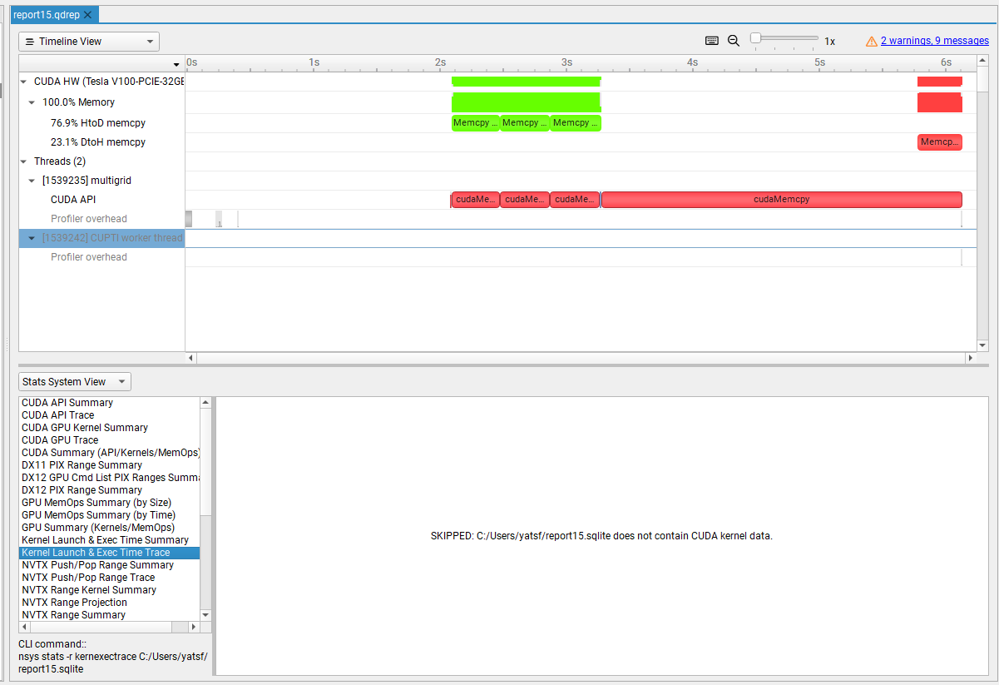

# Assignment 9 - Final Project
Group: 103

Architecture: THUNDERX2 HOST + NVIDIA

## 2a Preparation for profiling
We profiled the given code with `perf record ./multigrid 4 6 14 8` and used `perf report` to look 
at the profiling results.
```
Samples: 1M of event 'cycles', Event count (approx.): 454908914527                                                                                                                             
Overhead  Command    Shared Object      Symbol                                                                                                                                                 
  92.93%  multigrid  multigrid          [.] main
   6.50%  multigrid  multigrid          [.] Multigrid::solve
   0.43%  multigrid  [kernel.kallsyms]  [k] clear_page
   0.07%  multigrid  multigrid          [.] Multigrid::Multigrid
   0.01%  multigrid  [kernel.kallsyms]  [k] change_protection_range
   0.01%  multigrid  [kernel.kallsyms]  [k] get_page_from_freelist
   0.01%  multigrid  [kernel.kallsyms]  [k] try_charge
   0.01%  multigrid  [kernel.kallsyms]  [k] el0_da
   0.01%  multigrid  [kernel.kallsyms]  [k] __cpu_clear_user_page
```
We can see that most time is spent in main, but we it is not clear in which functions most of the time is spent. 

We therefore added the `__attribute__ ((noinline))` before the Jacobi.iterate, Restriction.iterate and
Prolongation.interpolation SetBoundary.itearte Multigrid.solve methods. This improved the profiling result. 
We can now runtime broken down into the different function calls.
As we can from the profiling results below the Jacobi iteration, error computation, interpolation and injection take up the most time. 
```
Samples: 1M of event 'cycles', Event count (approx.): 486302518434                                                                                                                        
Overhead  Command    Shared Object      Symbol                                                                                                                                            
  79.72%  multigrid  multigrid          [.] Jacobi::iterate
  10.69%  multigrid  multigrid          [.] ComputeError::computePointwiseError
   5.01%  multigrid  multigrid          [.] Prolongation::interpolation
   3.73%  multigrid  multigrid          [.] Restriction::injection
   0.37%  multigrid  [kernel.kallsyms]  [k] clear_page
   0.33%  multigrid  multigrid          [.] main
   0.08%  multigrid  multigrid          [.] Multigrid::Multigrid
   0.01%  multigrid  [kernel.kallsyms]  [k] el0_da
   0.01%  multigrid  [kernel.kallsyms]  [k] try_charge
   0.01%  multigrid  [kernel.kallsyms]  [k] change_protection_range
```

This gives a hint which functions to optimise, but we still don't know on which coarseness level we spent the most time.
We therefore added the coarseness level as a template parameter in multigrid.solve, jacobi.iteration, restriction.injection,
prolongation.interpolation. 
```cpp
 template <unsigned int level>
 FLOAT * __attribute__ ((noinline))solve(){
    ...
    iteration<level>(...)
    ...
    injection<level>(...)
    ...
    solve<level-1>(...)
    ...
    restriction<level>(...)
    ...
    iteration<level>(...)
 }
 
  template <>
  FLOAT * __attribute__ ((noinline))Multigrid::solve<0>( 
```
To avoid the error "template instantiation depth exceeds maximum of 900" we had to define a template specialization 
outside the class. 

We can see from the results, that the finest grid level take up the most time of the computation. 
And Jacobi iteration level 13 and 12 take up 74,20 % of the total runtime approximately. The smaller grid sizes 
don't take up much of the computation and are probably not worth parallelizing, due to the overhead associated with it.
```
Samples: 1M of event 'cycles', Event count (approx.): 484108202859                                                                                              
Overhead  Command    Shared Object        Symbol    
  58.90%  multigrid  multigrid            [.] Jacobi::iterate<13u>
  15.30%  multigrid  multigrid            [.] Jacobi::iterate<12u>
  10.70%  multigrid  multigrid            [.] ComputeError::computePointwiseError
   4.23%  multigrid  multigrid            [.] Jacobi::iterate<11u>
   3.90%  multigrid  multigrid            [.] Prolongation::interpolation<13u>
   2.76%  multigrid  multigrid            [.] Restriction::injection<13u>
   1.00%  multigrid  multigrid            [.] Prolongation::interpolation<12u>
   0.92%  multigrid  multigrid            [.] Jacobi::iterate<10u>
   0.73%  multigrid  multigrid            [.] Restriction::injection<12u>
   0.33%  multigrid  [kernel.kallsyms]    [k] clear_page
   0.25%  multigrid  multigrid            [.] Prolongation::interpolation<11u>
   0.24%  multigrid  libc-2.28.so         [.] __GI___memset_generic
   0.23%  multigrid  multigrid            [.] Jacobi::iterate<9u>
   0.19%  multigrid  multigrid            [.] Restriction::injection<11u>
   0.06%  multigrid  multigrid            [.] Prolongation::interpolation<10u>
   0.06%  multigrid  multigrid            [.] Jacobi::iterate<8u>
   0.05%  multigrid  multigrid            [.] Restriction::injection<10u>
   0.04%  multigrid  multigrid            [.] Multigrid::Multigrid
   0.01%  multigrid  multigrid            [.] Jacobi::iterate<7u>
   0.01%  multigrid  multigrid            [.] Prolongation::interpolation<9u>
   0.01%  multigrid  multigrid            [.] Restriction::injection<9u>
   0.01%  multigrid  [kernel.kallsyms]    [k] change_protection_range
   0.01%  multigrid  [kernel.kallsyms]    [k] el0_da
   0.01%  multigrid  [kernel.kallsyms]    [k] try_charge
```
This improved the results, but we still don't know on which coarseness level we spent the most time. We therefore converted 
## 4a - OpenMp Offloading
## Implementation 
We offloaded the whole program using openmp and keep the data on GPU as long as possible. We used the following data mapping clauses in **main.cpp** to keep the field1, field2 and rhs data stay in GPU from the very beginning (before initializing Multigrid, ComputerError and jacobi)
```
#pragma omp target enter data map(alloc: field1[0:(nx + 2) * (nx + 2)], field2[0:(nx + 2) * (nx + 2)], rhs[0:(nx + 2) * (nx + 2)])
...
...
#pragma omp target exit data map(alloc: field1[0:(nx + 2) * (nx + 2)], field2[0:(nx + 2) * (nx + 2)], rhs[0:(nx + 2) * (nx + 2)])
```
From the profiling result, we know that **Jacobi::iterate**, **ComputeError::computePointwiseError**, **Prolongation::interpolation** and **Restriction::injection** functions cost most of the time.
So We parallelized the For loops in ComputeError, Jacobi, Prolongation and Restriction using a **teams number = 120** and **threads number = 256**.
- ComputeError
```
 #pragma omp teams num_teams(numTeams) thread_limit(numThreads) 
    #pragma omp distribute parallel for reduction(max: _errorMax)
   for(unsigned int pos = 0; pos < _nx  * _ny ; pos++){
   // for(unsigned int pos = 0; pos < (_nx+2)  * _ny + 3+  _nx ; pos++){
        unsigned int tmp=0;
        tmp =( pos/ _nx )* (_nx+2) + pos % _nx + 3 + _nx;

     // if ((pos - _nx - 3)/(_nx+2)< _nx   && (pos - _nx - 3)%(_nx+2) < _ny ){
       _error[tmp] = fineGrid[tmp] - (((FLOAT)(pos/_nx + 1) * (pos % _nx + 1)) / ((FLOAT)(_nx + 1) * (_ny + 1)));
       
     if (fabs(_error[tmp]) > _errorMax)
        {
          _errorMax = fabs(_error[tmp]);
        }   
    }
```
- Jacobi
```
#pragma omp teams num_teams(120) thread_limit(256) 
    #pragma omp distribute parallel for 
    for(unsigned int pos = 0; pos < _nx * _ny; pos++){
        
        unsigned int tmp = 0;
        tmp =( pos/ _nx )* (_nx+2) + pos % _nx ; 

        writePtr[tmp] = _RHS * rhsPtr[tmp];
        writePtr[tmp] += _X * (readPtr_W[tmp] + readPtr_E[tmp]);
        writePtr[tmp] += _Y * (readPtr_S[tmp] + readPtr_N[tmp]);
       
    }
```
- Prolongation
```
 #pragma omp teams num_teams(128) thread_limit(128) 
    #pragma omp distribute parallel for 
for(unsigned int pos =  0;pos< _nxFineGrid * _nyFineGrid;pos++ ){
	  int row =  pos / (_nxFineGrid);
	  int col= pos % (_nxFineGrid);

      unsigned int coarse_index= row*(_nxFineGrid+ 2 ) + _nxFineGrid +3 + col;
    //  printf("current: %lf %d %d\n",fineGrid[coarse_index],row ,col);
      // Center
      if(col % 2 == 1 && row %2 == 1){
        fineGrid[coarse_index] += coarseGrid[ (row/2)*(_nxCoarseGrid+2)+(col/2) + _nxCoarseGrid + 3];
      }else if(row % 2 == 1 ){
        // Left 
          if(col >0 ){
            fineGrid[coarse_index] += 0.5* coarseGrid[(row/2)*(_nxCoarseGrid+2)+((col-1)/2)+ _nxCoarseGrid + 3];
          }
          // Right
          if(col < _nxFineGrid-1){
            fineGrid[coarse_index] +=0.5 *coarseGrid[(row/2)*(_nxCoarseGrid+2)+((col)/2)+ _nxCoarseGrid + 3];
          }
      }else if (col % 2 ==1){
          // interpolate Above 
          if(row >0 ){
            // printf("Above:%lf current: %lf %d %d\n",coarseGrid[(row/2)*(_nxCoarseGrid+2)+((col)/2)+ _nxCoarseGrid + 3],fineGrid[coarse_index],row ,col);
            fineGrid[coarse_index] += 0.5* coarseGrid[((row-1)/2)*(_nxCoarseGrid+2)+((col)/2)+ _nxCoarseGrid + 3];
          }
        // Below
          if(row < _nyFineGrid  -1){
            fineGrid[coarse_index] += 0.5* coarseGrid[(row/2)*(_nxCoarseGrid+2)+((col)/2)+ _nxCoarseGrid + 3];
          }
      }else{
        // interpolate left top
          if (row> 0 && col> 0){
            fineGrid[coarse_index] += 0.25 * coarseGrid[((row-1)/2)*(_nxCoarseGrid+2)+((col-1)/2)+ _nxCoarseGrid + 3];
          }
          // interpolate right top
          if (row> 0 && col< _nxFineGrid-1){
            fineGrid[coarse_index] += 0.25 * coarseGrid[((row-1)/2)*(_nxCoarseGrid+2)+((col)/2)+ _nxCoarseGrid + 3];
          }
        // interpolate left below
          if (row< _nyFineGrid -1 && col>0){
            fineGrid[coarse_index] += 0.25 * coarseGrid[((row)/2)*(_nxCoarseGrid+2)+((col-1)/2)+ _nxCoarseGrid + 3];
          }
          // interpolate right below
          if (row< _nyFineGrid -1 && col < _nxFineGrid-1){
            fineGrid[coarse_index] += 0.25 * coarseGrid[((row)/2)*(_nxCoarseGrid+2)+((col)/2)+ _nxCoarseGrid + 3];
          }
      }
```
- Restriction
```
 unsigned int coarsePos = 0;
    unsigned int finePos = 0;
    unsigned int j = 0;
    #pragma omp teams num_teams(120) thread_limit(128)
    #pragma omp distribute parallel for num_threads(128) 
    for(unsigned int i = 0; i < _nyCoarseGrid * _nxCoarseGrid; i++){
        unsigned int tmp = 0;
        unsigned int tmj = 0;
        tmp =( i/ _nxCoarseGrid )* (_nxCoarseGrid+2) + i % _nxCoarseGrid ; 
        tmj = ( i/ _nxCoarseGrid)* (2 * _nxCoarseGrid+ _nxFineGrid + 5) + (i %  _nxCoarseGrid) * 2 ;
       
        coarseRhs[tmp] = fineRhs[tmj];
        coarseRhs[tmp] -= (fineVal_W[tmj] - 2.0 * fineVal_C[tmj] + fineVal_E[tmj]) / _hxFineGrid2;
        coarseRhs[tmp] -= (fineVal_S[tmj] - 2.0 * fineVal_C[tmj] + fineVal_N[tmj]) / _hyFineGrid2;
        coarseVal1[tmp] = 0.0;
        coarseVal2[tmp] = 0.0;

    }
```
With those optimizations and team number **120** and threads number **256** we managed to get a runtime of around **8** seconds. compared to the initial runtime of **580+ seconds**. This measurement was done on ice2 system.


## Challenges during the OpenMP
- Run into mapping issues/compilation )
- Race Condition

## 4c - Cuda implementation  

## Implementation
We offloaded the whole programm to a GPU Kernel using a "single thread"
`multiGridKernel <<<1,1>>>(d_field1,d_field2,d_rhs,nx,multigridCycles,preSmoothing,postSmoothing,jacobiStepsCoarsestLevel);`
,which allocated the multigrid object on the GPU and calls other kernels.

```
for(...)
    iterate<<<dimGrid, dimBlock>>>(...);
...
injection<<<dimGrid2, dimBlock2>>>(...)
...
coarseSolutionField = _multigrid->solve(...)
...
interpolation<<<dimGrid, dimBlock>>>(...)
...
for(...)
    iterate<<<dimGrid, dimBlock>>>(...);
...
computeError<<<MIN(256,(((nx* nx)+nTPB-1)/nTPB)), nTPB>>>(currentSolution, max_value, nx ,nx );
```

We parallelized Jacobi, Prolongation and Restriction using a Block size of 32 
(32*32 = 1024 threads). 
For the ComputeError we used a changed version of Robert Crovella's Kernel 
(https://stackoverflow.com/questions/27925979/thrustmax-element-slow-in-comparison-cublasisamax-more-efficient-implementat%5B/url%5D)

With those optimizations we managed to get a runtime of around 4.1531 seconds. Leaving out one parallelization results in 
unacceptable runtime of 10+ minutes. Without any parallelization running the whole kernel on a single thread on the gpu 
results in 2 hours runtime.

### Problems we encountered
We tried to profile the application using nsys, ncu and nvprof. But we weren't able to trace the gpu kernel as stated in 
the assignment. This might be due to the use of CUDA Dynamic Parallelism, which we used to keep the data on the gpu 
throughout the whole computation.

(https://forums.developer.nvidia.com/t/is-it-possible-to-display-the-cdp-functions-in-nsight-systems/185478)

(https://forums.developer.nvidia.com/t/how-to-profile-dynamic-parallelism/203492)

(https://docs.nvidia.com/cuda/profiler-users-guide/index.html#profiler-known-issues)

As we can see on the image below nsys was not able to profile any CUDA kernel data. 


Afterwards, we measured through **ncu** by `ncu --set full -o report1 ./multigrid 4 6 14 8` and we got **report1.sqlite**.
But as shown in this pitcture, we cannot see any info regarding the function call as well.


Because of that we are going to restrict ourselves to the measured runtime. We collected through

```cpp
auto start = std::chrono::high_resolution_clock::now();
...
cudaDeviceSynchronize();
auto stop = std::chrono::high_resolution_clock::now();
auto duration = std::chrono::duration<double>(stop - start).count();
std::cout << "Time Spent " << duration <<std::endl;
```

## Limitations 
 We weren't able to use std::cout as there is 
no iostream implementation on the gpu. Therefore, we used `printf()`,but we weren't able to emulate to output like on 
std::cout and defaulted to using the scientific notation throughout whole precision range. 

```
# Our output
[h039y12@thx2 4c]$ ./multigrid 4 6 14 8
Iteration 0, Max-error: 1.62047e-02 
Iteration 1, Max-error: 3.39175e-04 
Iteration 2, Max-error: 7.56442e-06 
Iteration 3, Max-error: 1.76332e-07 
Iteration 4, Max-error: 4.23933e-09 
Iteration 5, Max-error: 1.07272e-10 
Iteration 6, Max-error: 5.91649e-12 
Iteration 7, Max-error: 4.38627e-12 
Time Spent 4.1531

# The reference output
[h039y12@thx2 4c]$ ./multigrid 4 6 14 8
Iteration 0, Max-error: 0.0162047
Iteration 1, Max-error: 0.000339175
Iteration 2, Max-error: 7.56442e-06
Iteration 3, Max-error: 1.76332e-07
Iteration 4, Max-error: 4.23933e-09
Iteration 5, Max-error: 1.07272e-10
Iteration 6, Max-error: 5.91649e-12
Iteration 7, Max-error: 4.38627e-12
```

The current limit on the grid size is 14. Running a higher grid size results in following error:
```  
[h039y12@thx2 4c]$ ./multigrid 4 6 15 8
CUDA error: too many resources requested for launch
```
This error can be resolved by reducing the block size from 32 (32*32=1024 threads per block) down to 2 
(2*2=4 threads per block).

## Challenges we ran into durin CUDA implementation
- not having cuda-gdb on the system
- Running out of heap space due to use the new operator on the kernel causing malloc errors. This was fixed by setting the heap space appropriately cudaDeviceSetLimit(cudaLimitMallocHeapSize, 1.8 * sizeof(FLOAT) * (nx+2)*(nx+2));
- Stackoverflow: compute-sanitizer also didn't provide any helpful insights on this problem. This was fixed by setting the stack size accordingly cudaDeviceSetLimit(cudaLimitStackSize, 4096);
```
[h039y12@thx2 4c]$ compute-sanitizer ./multigrid 4 6 14 8
========= COMPUTE-SANITIZER
========= Error: process didn't terminate successfully
=========     The application may have hit an error when dereferencing Unified Memory from the host. Please rerun the application under cuda-gdb or a host debugger to catch host side errors.
========= Target application returned an error
========= ERROR SUMMARY: 0 errors
``` 
- floating point order matters when parallelising prolongation as floating-point addition is not associative
   
## Shared memory Jacobi 
After trying to make use of shared memory on the Jacobi iteration, by loading in the data in first we got worse 
performance.
```cpp
__global__ void iterate(const FLOAT *const readField, FLOAT *const writeField, const FLOAT *const rhs, unsigned int _nx, unsigned int _ny, const FLOAT _X, const FLOAT _Y, const FLOAT _RHS)
{
  __shared__ FLOAT shared_read[(BLOCK_SIZE + 2) * (BLOCK_SIZE + 2)];

  int row = blockIdx.y * blockDim.y + threadIdx.y;
  int col = blockIdx.x * blockDim.x + threadIdx.x;
  unsigned int pos = row * _nx + col + 2 * row;

  if (row < _nx && col < _ny)
  {
    shared_read[threadIdx.y * (BLOCK_SIZE + 2) + threadIdx.x + BLOCK_SIZE + 2 + 1] = readField[pos + _nx + 2 + 1];
    // Top border
    if (threadIdx.y == 0)
    {
      shared_read[threadIdx.y * (BLOCK_SIZE + 2) + threadIdx.x + 1] = readField[pos + 1];
    }
    // Bottom border
    if (threadIdx.y == BLOCK_SIZE - 1 || row == _nx -1 )
    {
      shared_read[threadIdx.y * (BLOCK_SIZE + 2) + threadIdx.x + 2 * (2 + BLOCK_SIZE) + 1] = readField[pos + 2 * (_nx + 2) + 1];
    }
    // Left border
    if (threadIdx.x == 0)
    {
      shared_read[threadIdx.y * (BLOCK_SIZE + 2) + threadIdx.x + (BLOCK_SIZE) + 2] = readField[pos + _nx + 2];
    }
    // Right border
    if (threadIdx.x == BLOCK_SIZE - 1|| col == _nx-1)
    {
      shared_read[threadIdx.y * (BLOCK_SIZE + 2) + threadIdx.x + (3 + BLOCK_SIZE) + 1] = readField[pos + 3 + _nx + 1];
    }
        __syncthreads();

    // set pointers of 5-point stencil (only neighbour values) to very first inner grid point
    const FLOAT *readPtr_S = shared_read + 1;
    const FLOAT *readPtr_W = shared_read + ( BLOCK_SIZE + 2);
    const FLOAT *readPtr_E = shared_read + (BLOCK_SIZE + 4);
    const FLOAT *readPtr_N = shared_read + (2 * BLOCK_SIZE + 5);

    const FLOAT *rhsPtr = rhs + (_nx + 3);

    FLOAT *writePtr = writeField + (_nx + 3);

    writePtr[pos] = _RHS * rhsPtr[pos];
    writePtr[pos] += _X * (readPtr_W[threadIdx.y * (BLOCK_SIZE+2) +threadIdx.x] + readPtr_E[threadIdx.y * (BLOCK_SIZE+2) +threadIdx.x]);
    writePtr[pos] += _Y * (readPtr_S[threadIdx.y * (BLOCK_SIZE+2) +threadIdx.x] + readPtr_N[threadIdx.y * (BLOCK_SIZE+2) +threadIdx.x]);
  }
}
```

We are getting around 4.3 seconds compared to 4.1 seconds without shared memory. This might be due to the high band width 
of the gpu and the need for a synchronization barrier for the threads and conditional loading of the edges. 
In addition to that a grid point is only getting used for up to 4 computations. 
This doesn't increase with the data sizes like in the matrix matrix multiplication.
```cpp
[h039y12@thx2 4c-shared]$ ./multigrid 4 6 14 8
Iteration 0, Max-error: 1.62047e-02 
Iteration 1, Max-error: 3.39175e-04 
Iteration 2, Max-error: 7.56442e-06 
Iteration 3, Max-error: 1.76332e-07 
Iteration 4, Max-error: 4.23933e-09 
Iteration 5, Max-error: 1.07272e-10 
Iteration 6, Max-error: 5.91649e-12 
Iteration 7, Max-error: 4.38627e-12 
Time Spent 4.3908
```

## Outlook 
Due to the unfamiliarity with advanced topics in CUDA like using objects, heap limit, stack limit and dynamic parallelism. 
I unfortunately wasn't able to further test multi-gpu and cache optimizations. 